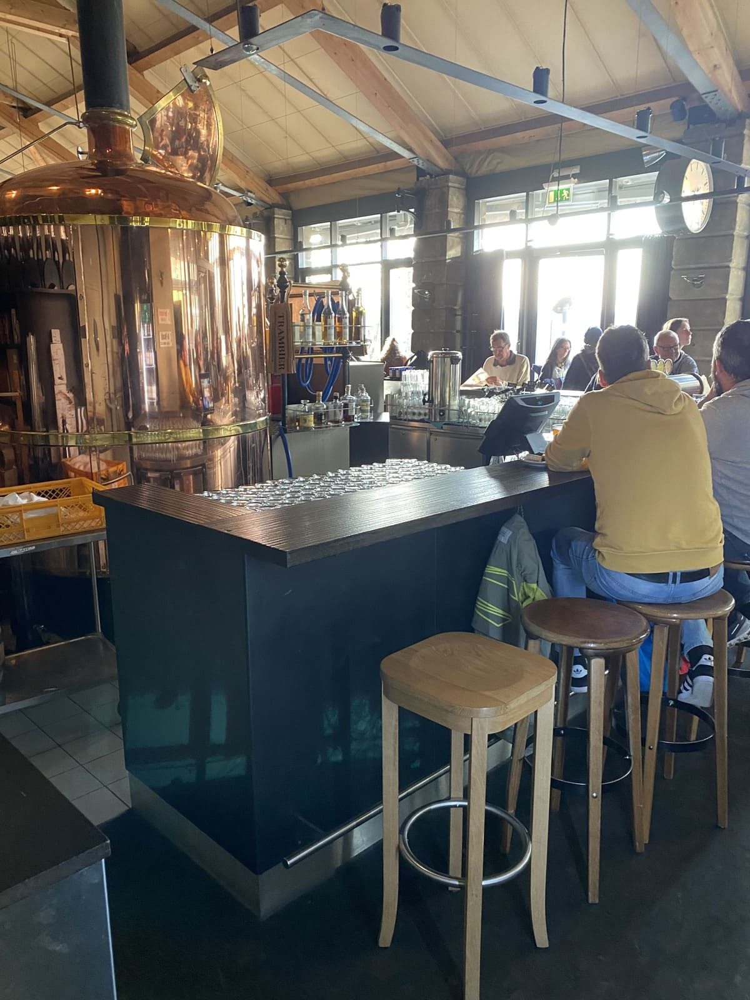

+++
title = "Im Reich des Bieres"
date = "2022-12-01"
draft = false
pinned = false
+++


Jordan Burn und Yannick Geiger besuchen die Bierbrauerei und das Gastronomielokal „Altes Tramdepot“ in Bern und schauen sich mal genauer an, wie Bier gebraut wird. Dabei erfahren wir wie in der Brauerei „altes Tramdepot“ der Brauprozess abläuft, und was man alles beachten muss.



# Unser Besuch in der Brauerei

Die Ankunft

Am Montag, dem 10.10.2022, treten wir, Jordan Burn und Yannick Geiger, in die Bierbrauerei “Altes Tramdepot” beim Bärengraben in Bern ein. Uns fallen sofort zwei grosse und eindrückliche Kupfertanks, bei der Bar, ins Auge. Nun laufen wir zu der Rezeption. Da werden wir freundlich an der Rezeption aufgefordert, kurz auf Matthias Koschahre, mit dem wir uns zuvor verabredet haben, zu warten. Er wird uns durch die Brauerei führen und uns ein Interview geben. Matthias Koschahre empfängt uns knapp zwei Minuten später und beginnt dann direkt mit der Führung für uns durch die Brauerei. Den Brauprozess können wir leider nicht sehen, da hier Heute nicht gebraut wird. Das “Altes Tramdepot” ist nur eine kleine Brauerei, hier wird nicht täglich Bier gebraut, da es nicht genügend Abnehmer für das ganze Bier gibt. 

# 

Das “alte Tramdepot” war früher, wie der Name schon vorwegnimmt, ein Depot für Trams. Doch dieses Depot wurde 1941 stillgelegt und seitdem für viele verschiedene Zwecke genutzt. Es diente zum Beispiel als Depot für Bühnenbilder und Requisiten des Stadttheaters. Schliesslich entschied man sich im Jahre 1994 dazu, das Tramdepot zu sanieren und es als gastronomischen und kulturellen Treffpunkt zu nutzen. Seitdem wurde es noch etliche Male umgebaut, um die Bierproduktion zu verbessern und das Lokal zu erweitern.

``

Die Führung

Zuerst sehen wir das Lager der Brauerei. Beim Betreten des Lagers, stechen uns die riesigen Gerstensäcke ins Auge. Im Lager werden wöchentlich die Lieferungen der verschiedenen Gerstensorten gelagert. Wir dürfen im Lager die verschiedenen Gerstensorten in unterschiedlichen Röststufen probieren und stellen fest, dass uns der Geschmack an Haferflocken erinnert. Je stärker die Röstung der Gerste, desto mehr nimmt sie den Geschmack von Kaffee an. Matthias Koschahre sagt dazu, dass wir gerade das probieren würden, was ebenfalls in Farmerriegeln verarbeitet wird. Zunächst sehen wir, wie die Gerste gleich im Lager geschrotet und dann direkt zu zwei grossen Kupfertanks getragen wird. Dort wird die geschrotete Gerste mit Wasser im Tank vermischt. 

Die beiden grossen Tanks stehen mitten im Lokal der Brauerei, was sehr eindrücklich auf uns wirkt. Erst als wir in die Tanks hineingeschaut haben, merken wir, wie gross sie tatsächlich sind. Matthias Koschahre erzählt uns, dass die Tanks nur aussen aus Kupfer bestünden. Das Kupfer sei nur aus Dekorations- und Traditionsgründen da. Früher habe man diese Tanks nämlich nur aus Kupfer hergestellt. Mittlerweile bestünden sie aber im Inneren aus hygienischen Gründen aus Edelstahl. In diesen beiden Tanks befinden sich zwei grosse Platten mit Löchern. Diese dienen dazu, den Sud umzurühren, während er auf eine Temperatur von 60 Grad Celsius erhitzt wird. Diese Temperatur ist notwendig, damit die Stärke während des Prozesses in Zucker umgewandelt werden kann. Im Anschluss folgen wir einem grossen Rohr mit einem Filter, welches aus einem der Tanks hinausragt. 

Dieses Rohr führt uns in einen weiteren abgeschlossen Raum. Dort sehen wir einen grossen, flachen Zylinder, an dem Rohre angeschlossen sind. Dieser Zylinder diene, wie Matthias Koschahre erzählt, zur Trennung vom vorher entstandenen Sud, den Feststoffen und dem Eiweiss. Dieser Prozess funktioniert dabei wie bei einer Zentrifuge. 

Nun steigen wir hinab in den Keller des Gebäudes und stehen vor einer breiten und hohen Glasfront, hinter der grosse Tanks mit Bier an einem langen Rohrsystem angeschlossen sind. Der Blick auf die Tanks zeigt uns erst richtig auf, wie viel Bier hier gelagert wird. Wir laufen durch eine Glastür und bemerken dabei direkt einen Temperaturunterschied, der zwischen dem Lagerraum und dem restlichen Gebäude herrscht. Dieser Raum dient zum Kühlen, Lagern und Reifen des Bieres. An jedem Tank hängt ein Zettel, auf welchem steht, seit wann das Bier dort gelagert wird und wie hoch der Alkoholgehalt sowie der Kohlensäuregehalt ist. Am Ende dieses grossen Raumes erblicken wir eine Abfüllmaschine und fragen Matthias Koschahre: „Wie viel Export betreiben Sie?“ Darauf antwortet er: „Wir betreiben nicht so viel Export, da es sich bei unserem Bier um ein Frischprodukt handelt, [das](<>) man nicht so gut exportieren kann. Ausserdem ist unsere Brauerei zu klein, um internationalen Export zu betreiben.“  Danach schauen wir uns noch genauer im Raum um und sehen an der Decke Rohre, die direkt zur Bar nach oben führen, wo das Bier dann frisch gezapft wird. 

An die Bar des Tramdepots gehen wir dann auch und wählen einen Tisch, der etwas abgelegen von den anderen Leuten steht, an dem wir das Interview durchführen. Nach dem Gespräch bedanken wir uns bei Matthias Koschahre dafür, dass er sich die Zeit genommen hat, um uns die Brauerei zu zeigen und unsere Fragen zu beantworten. Ein spannender und lehrreicher Besuch in der Brauerei “Altes Tramdepot” endet nun für uns. Wir haben viel Neues und Interessantes für unsere Reportage in Erfahrung gebracht.

*„Also das Erste, was ich gemacht habe. Ich habe eine Wette gewonnen.“* 

*Matthias Koschahre, Leiter der Brauerei „Altes Tramdepot“*

# 

Matthias Koschahre, geboren 1983, ist der Leiter der Brauerei „Altes Tramdepot“ und das schon seit über vier Jahren. Er besitzt einen Instagram Account, auf dem er gelegentlich Posts macht, die meistens in Verbindung mit seinem Bier oder der Brauerei stehen.

``

# Das Interview mit Herrn Koschahre

Nach der Führung setzen wir uns zusammen mit Herrn Koschahre an einen Tisch, um im Interview unsere Fragen an ihn zu richten. Wir stellen ihm einerseits Fragen, die interessant für uns sind und andererseits solche, die uns helfen, die Faszination hinter dem Bierbrauen zu verstehen. Denn das Brauen ist für viele Brauer nicht nur ein Beruf, sondern vielmehr eine Leidenschaft. 

*„Es ist für mich kein Beruf in der Art und Weise. Es ist mein Leben. “*  

*Matthias Koschahre, Leiter der Brauerei „Altes Tramdepot“*

Unsere erste Frage an ihn lautet: „Was hat Sie zum Beruf des Bierbrauers gebracht und was interessiert Sie besonders an diesem Beruf?“ Darauf antwortet er uns prompt: „Also das Erste, was ich gemacht habe. Ich habe eine Wette gewonnen.“ Da sind wir natürlich erst erstaunt. Mit dieser Art von Antwort haben wir nicht gerechnet. Weiter erklärt er, dass er sich mit seinem besten Freund in einer Brauerei beworben habe und er derjenige gewesen sei, der die Stelle bekommen habe. Die Wette sei gewesen, dass der, der angestellt werden würde, einen Kasten Bier erhielt. Doch anfangs sei er von seinem Beruf als Bierbrauer genervt gewesen, weil er nur für das Putzen der Tanks zuständig gewesen sei. Der Spass am Bierbrauen sei erst später gekommen und jetzt ist er [vollkommen ](<>)überzeugt von seinem Beruf. Das Brauen sei für ihn kein Beruf in der Art und Weise, es sei sein Leben. Im Verlauf seiner Ausführung sagt er: „Es *ist für mich kein Beruf in der Art und Weise. Es ist mein Leben.”*

Weiter Fragen wir Matthias Koschahre: „Wieso hat sich das so drastisch verändert? Wodurch kam das zustande?“ Er antwortet darauf: “Mit Beginn des ersten Schulblocks oder des zweiten Schulblocks, wo es dann um Fachwissen ging. Wo es dann da drum ging, effektiv Bier herzustellen.” Weiter erklärt er, dass er vorher immer nur die Tanks geputzt habe und es erst mit dem Fachwissen übers Bierbrauen zu einer Leidenschaft wurde. 

Bei dieser Antwort kommt bei uns die Frage auf, ob er ein besonderes, schönes oder Erinnerns wertes Erlebnis, von dem er uns erzählen könne, hätte. Darauf antwortet er: “Es gab viele spezielle Momente, aber letzten Endes hängt es immer mit dem Team zusammen. Hast du ein gutes Team, hast du immer wieder Momente, wo geile Aktionen entstehen.” Weiter fährt er damit fort, dass es schon Wasserschlachten gegeben habe und es solche Aktionen immer wieder gäbe. Das Schönste für ihn sei allerdings, am Freitagnachmittag mit seinen Leuten zusammen zu sitzen und ein Bier zu trinken. 

So Fragen wir ihn dann: „Was sind die grössten Herausforderungen beim Bierbrauen oder gerade in ihrer Position als Leiter?“  und er antwortet auf diese Frage: „In meiner Position ist es doch definitiv die Verantwortung. Du stehst, du repräsentierst als Gesicht das Getränk.“ Matthias Koschahre erklärt weiter, dass er die ganze Kritik aufnehme und diese Kritik immer subjektiv sein müsse. Für ihn sei das grösste Problem die Verantwortung. 

Nun interessiert uns noch ein Punkt. Nämlich hatten wir im Internet gelesen, dass einige seiner Biere bei den Swiss Beer Awards gewonnen haben. Also fragen wir nach: “Hat sich das so zustande gestellt, da sie ja nicht jedes Jahr gewonnen haben, dass sich das Rezept mit der Zeit verändert und anpasst, oder bleibt es ungefähr das Gleiche? “ Er antwortet auf diese Frage: „Nein, mein Vorgänger ist gegangen und wir haben dran rumgeschraubt.“ Weiter erzählt er uns, dass jeder Bierbrauer seine eigene Handschrift unter jedes Getränk setze. Wenn es dem Bierbrauer nicht passe, schraube er so lange daran herum, bis es ihm passt und so habe er es auch gemacht. Dadurch habe sich das Bier anscheinend verbessert.

Aber ihn interessiere der Swiss Beer Award gar nicht so sehr. Es gebe andere Awards, die für ihn einen höheren Stellenwert hätten. Aber seine Brauerei könne sich ja nicht so wirklich mit den grossen Brauereien messen. Sie besässen nicht die gleichen Mittel wie die grossen Brauereien. Deshalb sei der Award auch nicht so bedeutend für ihn und er sei auch mit der Silber- und Bronzemedaille zufrieden. 

An dieser Stelle haken wir natürlich nochmals nach und fragen ihn: „Welcher Award hätte den für Sie einen viel grösseren Stellenwert?“ „Das wäre der European Brewers Convention Award, der nennt sich so.“ gibt er uns zur Antwort. Weiter führt er aus, dass es noch andere Awards gäbe, die erstrebenswert sind. Dazu gehöre zum Beispiel der European Beer Star, aber für diesen sei die Brauerei zu klein.  Zum Abschluss des Interviews bedanken wir uns bei Matthias Koschahre für das geduldige und offene Beantworten unserer Fragen und die Zeit, die wir mit ihm verbringen durften. 

# Unser Fazit

Uns beeindruckte die Führung durch die Brauerei sehr. Mit dieser beachtlichen Anzahl an aufschlussreichen und spannenden Informationen hatten wir nicht gerechnet. Wir brachten allerlei neue Dinge in Erfahrung und konnten während der Führung einen genauen Einblick in die Bierherstellung gewinnen. Es war sehr eindrücklich für uns zu sehen, wie viel Arbeit und Mühe hinter der Bierbrauerei steckt und auf welche Details geachtet werden muss. Bier ist nicht einfach schnell gebraut, es ist vielmehr ein wochenlanger, aufwändiger und leidenschaftlicher Prozess. Bier ist kein Getränk, es ist eine Leidenschaft.